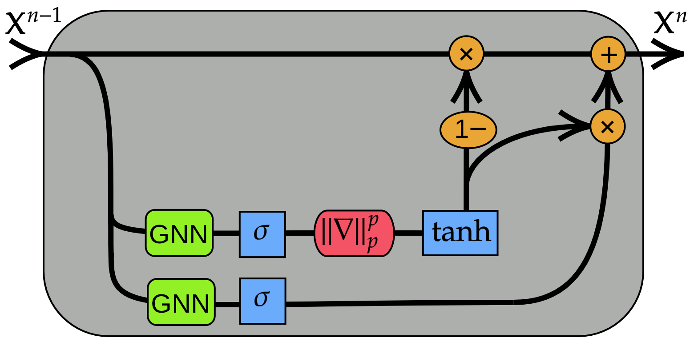

<h1 align='center'> Gradient Gating for Deep Multi-Rate Learning on Graphs </h1>

This repository contains the implementation to reproduce the numerical experiments of the **ICLR 2023** paper [Gradient Gating for Deep Multi-Rate Learning on Graphs](https://openreview.net/forum?id=JpRExTbl1-)

[](https://paperswithcode.com/sota/node-classification-on-arxiv-year?p=gradient-gating-for-deep-multi-rate-learning)
[](https://paperswithcode.com/sota/node-classification-on-genius?p=gradient-gating-for-deep-multi-rate-learning)
[](https://paperswithcode.com/sota/node-classification-on-snap-patents?p=gradient-gating-for-deep-multi-rate-learning)

<p align="center">

</p>

### Requirements
Main dependencies (with python >= 3.7):<br />
torch==1.9.0<br />
torch-cluster==1.5.9<br />
torch-geometric==2.0.3<br />
torch-scatter==2.0.9<br />
torch-sparse==0.6.12<br />
torch-spline-conv==1.2.1<br />

Commands to install all the dependencies in a new conda environment <br />
*(python 3.7 and cuda 10.2 -- for other cuda versions change accordingly)*
```
conda create --name gradientgating python=3.7
conda activate gradientgating

pip install torch==1.9.0

pip install torch-scatter -f https://pytorch-geometric.com/whl/torch-1.9.0+cu102.html
pip install torch-sparse -f https://pytorch-geometric.com/whl/torch-1.9.0+cu102.html
pip install torch-cluster -f https://pytorch-geometric.com/whl/torch-1.9.0+cu102.html
pip install torch-spline-conv -f https://pytorch-geometric.com/whl/torch-1.9.0+cu102.html
pip install torch-geometric
pip install scipy
pip install numpy
```

# Citation
If you found our work useful in your research, please cite our paper at:
```bibtex
@inproceedings{rusch2022gradient,
  title={Gradient Gating for Deep Multi-Rate Learning on Graphs},
  author={Rusch, T Konstantin and Chamberlain, Benjamin P and Mahoney, Michael W and Bronstein, Michael M and Mishra, Siddhartha},
  booktitle={International Conference on Learning Representations},
  year={2023}
}
```
(Also consider starring the project on GitHub.)
